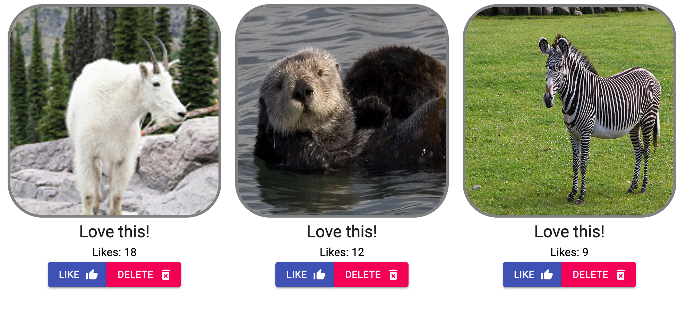

# React Gallery

[Project Instructions](./INSTRUCTIONS.md), this line may be removed once you have updated the README.md

## Description

React Gallery is a full-stack application built over a weekend using React for the frontend, Node/Express for the backend, and PostgreSQL for the database. The project simulates an art gallery where the user can like new art pieces, delete them, and new ones.

## Screen Shot

## Prerequisites

[Node.js](https://nodejs.org/en/)  
[NPM](https://www.npmjs.com/)  
[Postico](https://eggerapps.at/postico/)  
[React](https://reactjs.org/)

## Installation

1. Create a database named 'react_gallery' using Postico
2. The queries in the database.sql file are set up to create all the necessary tables. Copy and paste this file into Postico to generate the tables.
3. Run the 'npm install' command to install all the necessary components
4. Run the 'npm run server' command to start the server
5. Run the 'npm run client' command to start the client
6. The application should open a new window within your default browser

## Usage

1. The browser should resemble the screen shot image. The first thing on the page will be a form for the user to post new images to the server.

2. There will be two inputs, the first will be an input which accepts an image url, and the second will be an alternative description of the image. Clicking the submit button will submit a new image to the server.

3. There will also be a gallery of items featuring an image, the amount of likes each image has, and two buttons which the user can interact with.

4. The first button will be a 'like' button which the user can click to like an image, the second will be a delete button allowing the user to delete an image from the server.

## Built With

1. Express
2. Material-UI
3. Node.js
4. React
5. PostgreSQL
6. Uppy

## Acknowledgement

Thanks to [Prime Digital Academy](https://github.com/PrimeAcademy/readme-template/blob/master/www.primeacademy.io) who helped me to complete this project as well as the Cullen Cohort.
